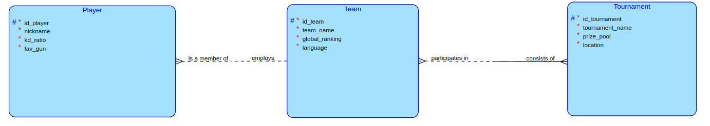

# Semestrálna práca TJV - CS2 portál

## Téma

Moje téma semestrálky na TJV je inšpirované semestrálkou na DBS a to konkrétne hrou CS2(predtým známe ako CS:GO). Budem pracovať s informáciami o hráčoch, profesionálných e-sport tímoch a turnajoch.

## Business operace

Klient sa pokúsi pridať tím na turnaj, ak ale súčet všetkých prizepoolov turnajov, na ktorých daný tím hrá by presiahol 10 000 000, klient to zakáže , inak ho pridá na turnaj.

## Komplexný dotaz
Vymazanie všetkých hráčov, ktorý majú K/D pod 1.00 a hrajú v top 30 tímoch na svete.

## DIAGRAM

## Spustenie

Semestrálka sa skladá z klienta na porte 9000 a serveru na 8080. Ak máte nainštalované potrebné veci, tak stačí stiahnuť a spustiť klienta a server.

